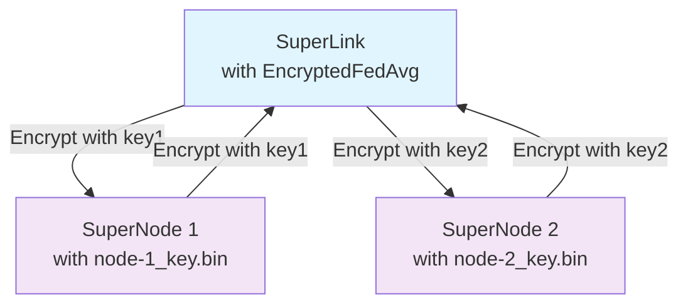

# Flower Federations with Authentication and Encrypted Weights 🧪

The following steps describe how to start a long-running Flower server (SuperLink) and long-running Flower clients (SuperNodes) with authentication enabled **and encrypted weight transmission**. The task is to train a simple CNN for image classification using PyTorch, where all model weights are encrypted during transmission between server and clients.

This example extends the basic [flower-authentication](../flower-authentication/) example by adding AES-256-GCM encryption to protect model weights during federated learning rounds. Each client node has its own unique encryption key, ensuring secure per-node communication.

## 🔐 Security Features

- **SuperNode Authentication**: Public-private key authentication for client verification
- **TLS Communications**: Encrypted communications between all components  
- **Encrypted Model Weights**: AES-256-GCM encryption of model parameters during transmission
- **Per-Node Encryption Keys**: Individual encryption keys for each participating client

> [!TIP]
> Follow this [how-to guide](https://flower.ai/docs/framework/how-to-run-flower-with-deployment-engine.html) to learn more about Flower's Deployment Engine, how setting up [secure TLS-enabled communications](https://flower.ai/docs/framework/how-to-enable-tls-connections.html) and [SuperNode authentication](https://flower.ai/docs/framework/how-to-authenticate-supernodes.html) works.

## Project Setup

Start by cloning the example project. We prepared a single-line command that you can copy into your shell which will checkout the example for you:

```shell
git clone --depth=1 https://github.com/adap/flower.git _tmp \
        && mv _tmp/examples/flower-authentication-encrypted . \
        && rm -rf _tmp && cd flower-authentication-encrypted
```

This will create a new directory called `flower-authentication-encrypted` with the following project structure:

```shell
flower-authentication-encrypted
├── authexample
│   ├── __init__.py
│   ├── client_app.py         # Defines your ClientApp with encryption
│   ├── server_app.py         # Defines your ServerApp with encryption
│   ├── task.py              # Defines your model, training and data loading
│   └── encryption.py        # Encryption/decryption utilities
├── pyproject.toml           # Project metadata like dependencies and configs
├── certificate.conf         # Configuration for OpenSSL
├── generate_cert.sh         # Generate TLS certificates
├── generate_auth_keys.sh    # Generate authentication keys  
├── generate_encryption_keys.sh # Generate encryption keys for weight protection
├── prepare_dataset.py       # Generate datasets for each SuperNode to use
├── .gitignore              # Git ignore file
├── .flowerignore           # Flower packaging ignore file (excludes large datasets)
└── README.md
```

### Install dependencies and project

First, create and activate a virtual environment for better isolation. **Important**: Create the virtual environment outside the project directory to avoid FAB size issues:

```bash
cd ..
python3 -m venv flower_auth_env
source flower_auth_env/bin/activate  # On Windows: flower_auth_env\Scripts\activate
cd flower-authentication-encrypted
```

Install the dependencies defined in `pyproject.toml` as well as the `authexample` package:

```bash
pip install -e .
```

## Generate TLS certificates

The `generate_cert.sh` script generates certificates for creating a secure TLS connection between the SuperLink and SuperNodes, as well as between the flwr CLI (user) and the SuperLink.

> [!NOTE]
> Note that this script should only be used for development purposes and not for creating production key pairs.

```bash
./generate_cert.sh
```

## Generate public and private keys for SuperNode authentication

The `generate_auth_keys.sh` script generates two private–public key pairs for two SuperNodes by default. If you have more SuperNodes, you can specify the number of key pairs to generate.

> [!NOTE]
> Note that this script should only be used for development purposes and not for creating production key pairs.

```bash
# Generate two key pairs by default
./generate_auth_keys.sh

# Or pass the desired the number of key pairs
./generate_auth_keys.sh {your_number_of_clients}
```

## Generate encryption keys for weight protection

The `generate_encryption_keys.sh` script generates symmetric encryption keys for encrypting model weights during transmission. Each SuperNode gets its own unique 256-bit AES key.

> [!WARNING]
> These keys are for development/testing only. In production, use proper key management systems and secure key distribution.

```bash
# Generate encryption keys for 2 nodes (default)
./generate_encryption_keys.sh

# Or specify the number of encryption keys
./generate_encryption_keys.sh {your_number_of_clients}
```

This will create an `encryption_keys/` directory with files like:
```
encryption_keys/
├── node-1_key.bin
└── node-2_key.bin
```

## Start the long-running Flower server (SuperLink)

Starting the long-running Flower server component (SuperLink) with authentication enabled:

```bash
flower-superlink \
    --ssl-ca-certfile certificates/ca.crt \
    --ssl-certfile certificates/server.pem \
    --ssl-keyfile certificates/server.key \
    --enable-supernode-auth
```

At this point your server-side is idling. Next, let's connect two `SuperNode`s, and then we'll start a run.

## Start the long-running Flower client (SuperNode)

> [!NOTE]
> Typically each `SuperNode` runs in a different entity/organization which has access to a dataset. In this example we are going to artificially create N dataset splits and saved them into a new directory called `datasets/`. Then, each `SuperNode` will be pointed to the dataset it should load via the `--node-config` argument.

Prepare the dataset partitions (this may take a few minutes to download CIFAR-10):

```bash
python prepare_dataset_simple.py
```

> [!TIP]
> If you encounter issues with the default `prepare_dataset.py` due to Python version compatibility, use `prepare_dataset_simple.py` instead, which uses PyTorch directly to create the dataset partitions.

### Pre-registering SuperNodes

Before connecting the `SuperNodes` we need to register them with the `SuperLink`. This means we'll tell the `SuperLink` about the identities of the `SuperNodes` that will be connected.

Let's register the first `SuperNode`:

```shell
flwr supernode register keys/client_credentials_1.pub . my-federation
# It will print something like:
# Loading project configuration...
# Success
# ✅ SuperNode 16019329408659850374 registered successfully.
```

Then, we register the second `SuperNode`:

```shell
flwr supernode register keys/client_credentials_2.pub . my-federation
# It will print something like:
# Loading project configuration...
# Success
# ✅ SuperNode 8392976743692794070 registered successfully.
```

You can view the status of the `SuperNodes`:

```shell
flwr supernode list . my-federation
```

### Connecting SuperNodes

In a new terminal window, start the first long-running Flower client (SuperNode):

```bash
flower-supernode \
    --root-certificates certificates/ca.crt \
    --auth-supernode-private-key keys/client_credentials_1 \
    --superlink "127.0.0.1:9092" \
    --node-config 'dataset-path="datasets/cifar10_part_1" node-id="node-1" encryption-key="encryption_keys/node-1_key.bin"' \
    --clientappio-api-address="0.0.0.0:9094"
```

In yet another new terminal window, start the second long-running Flower client:

```bash
flower-supernode \
    --root-certificates certificates/ca.crt \
    --auth-supernode-private-key keys/client_credentials_2 \
    --superlink "127.0.0.1:9092" \
    --node-config 'dataset-path="datasets/cifar10_part_2" node-id="node-2" encryption-key="encryption_keys/node-2_key.bin"' \
    --clientappio-api-address="0.0.0.0:9095"
```

> [!IMPORTANT]
> Notice the additional `node-id` and `encryption-key` parameters in the `--node-config`. These are required for the encrypted weight transmission:
> - `node-id`: Unique identifier for this node (matches the encryption key naming)
> - `encryption-key`: Path to this node's unique encryption key file

## Run the Flower App

With both the long-running server (SuperLink) and two SuperNodes up and running, we can now start the run:

```bash
flwr run . my-federation --stream
```

## How Encryption Works

### Weight Encryption Process

1. **Server Side**: The `EncryptedFedAvg` strategy encrypts the global model using each client's unique key before sending training/evaluation tasks
2. **Client Side**: Each client decrypts the received weights using its private key, performs local training/evaluation, then encrypts the updated weights before sending back to server  
3. **Aggregation**: The server decrypts all received weight updates using the corresponding client keys, then aggregates them into a new global model

### Key Features

- **AES-256-GCM Encryption**: Industry-standard authenticated encryption
- **Per-Node Keys**: Each client has a unique encryption key, preventing cross-client data access
- **Transparent Integration**: Encryption/decryption happens automatically within the Flower framework
- **Fallback Support**: Gracefully handles mixed encrypted/unencrypted scenarios during first round

### Security Considerations

> [!WARNING]
> This example is for demonstration purposes. In production deployments:
> - Use proper key management systems (e.g., HashiCorp Vault, AWS KMS)
> - Implement secure key distribution mechanisms  
> - Regularly rotate encryption keys
> - Use hardware security modules (HSMs) for key storage
> - Add additional authentication layers

## Architecture Overview



The encrypted weights are transmitted as numpy arrays of `uint8` dtype, containing the nonce and ciphertext needed for AES-GCM decryption.

## Troubleshooting

### Common Issues

1. **Dataset Preparation Fails**: If `prepare_dataset.py` fails due to Python version compatibility, use `prepare_dataset_simple.py` instead.

2. **Node Config Format Error**: Ensure `--node-config` uses space-separated key-value pairs:
   ```bash
   --node-config 'key1="value1" key2="value2" key3="value3"'
   ```
   **NOT** comma-separated like `'key1="value1",key2="value2"'`

3. **SuperNode Registration Issues**: Make sure the SuperLink is running before registering SuperNodes.

4. **Certificate Issues**: Ensure all certificate files are generated and have correct permissions.

5. **Virtual Environment**: Always activate your virtual environment before running commands:
   ```bash
   source venv/bin/activate  # On Windows: venv\Scripts\activate
   ```

6. **FAB Size Exceeds Limit**: If you get "FAB size exceeds maximum allowed size" error:
   - Ensure `.flowerignore` file exists and includes common virtual environment names
   - Remove large directories: `rm -rf datasets/ venv/ .venv/ *_env/ *.pt`
   - The virtual environment should be created outside the project directory
   - Datasets will be recreated automatically when SuperNodes start
   - The FAB package should be <1MB for successful deployment

### Testing Steps

1. Start SuperLink: `flower-superlink --ssl-ca-certfile certificates/ca.crt --ssl-certfile certificates/server.pem --ssl-keyfile certificates/server.key --enable-supernode-auth`
2. Register both SuperNodes using their public keys
3. Start both SuperNodes in separate terminals
4. Verify both are online: `flwr supernode list . my-federation`  
5. Run federated learning: `flwr run . my-federation --stream`

The example should complete 3 rounds of federated learning with encrypted weight transmission.